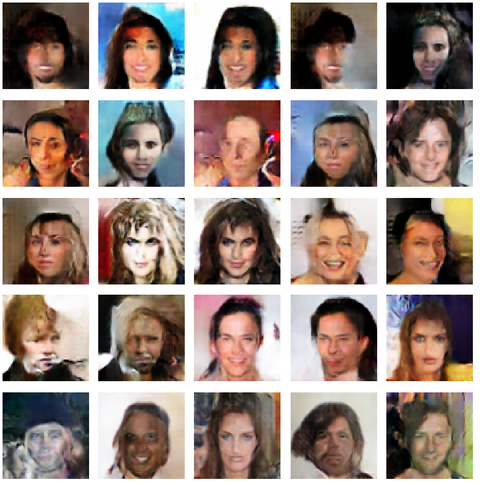
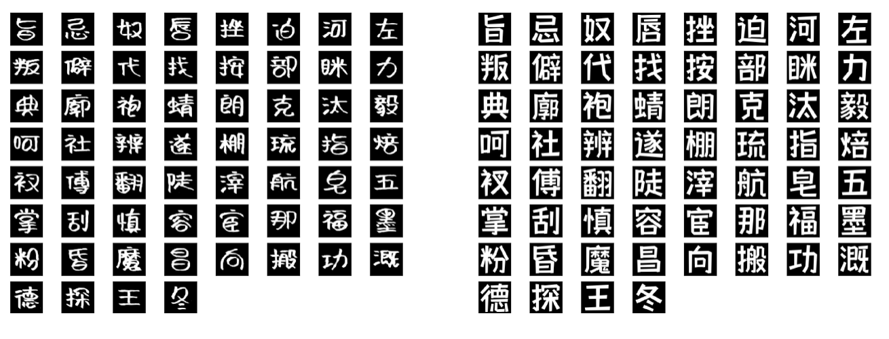
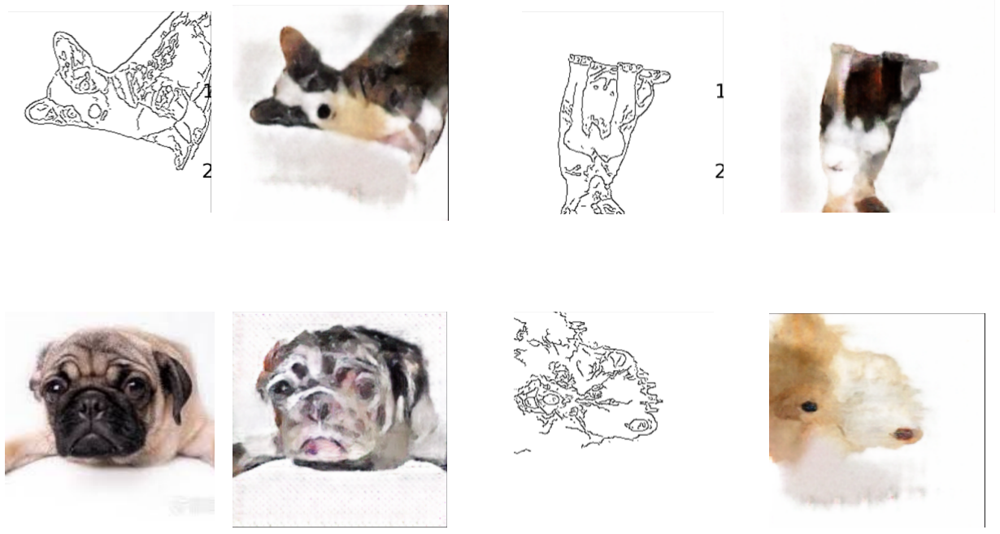

# Reimplentation GAN and pix2pix
This repository is the reimplementation of GAN and cGAN(pix2pix) with pytorch.  

gan_celeba.py, gan_mnist, gan_cifar10 is the basic GAN. 

The edge2dog is similar to edge2cat(https://affinelayer.com/pixsrv/). The images are downloaded from google and I make lots of data augumentation such as rotation. 

The zi2zi is similar to https://kaonashi-tyc.github.io/2017/04/06/zi2zi.html. However, I didn't take categorical loss so that the model can only generate one style of font by one model. 

The zi2zi model and edge2dog model's generator is UNet and the discriminator has the same number conv (It is very cricial).

# Results
The following is virtual people generated from basic GAN(DCGAN).   

The following is font2font. Without categorical loss, the model can only generated just one style. It is similar to auto-encoder. This model is just a demo which doesn't show the power of cGAN.

The following is edge2dog which is similay to edge2cat. I take patchGAN strategy and L1 regularization with 0.1 penalty. The right corner is the original images, beside which the dog is generated from my model.

